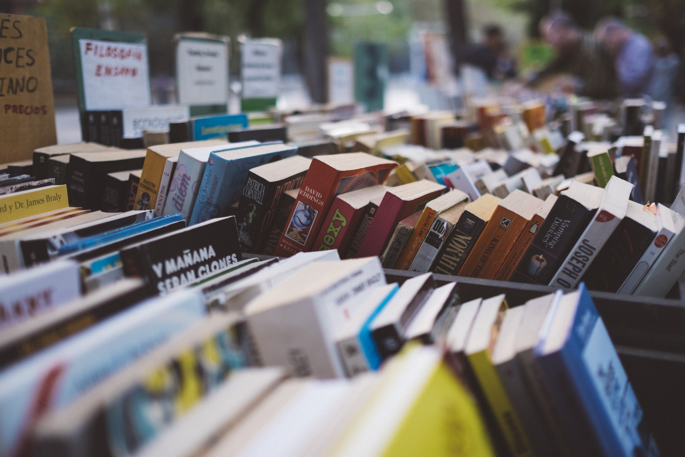

# Books

You can learn so much from books that it deserves its own section on this website.
Not only learning but also opening your mind, dreaming, traveling. Books are really a gate to an enourmous amount of knowledge and stories.

A really good initiative that you can find in many cities is called **book exchange**.  
This is a place where you can go to and pick upany book you like. Or you can drop one you have finish reading.  
It's all for free, you don't even have to give a book away in order to receive one. But if you do it's great as it keeps the system going.
I know these kind of actions always sounds a bit utopist but they do really exist.

You can also go to a **2nd hand book store** and find great titles under very low price.
Another option is also to visit your local **library**, there you'll easily find the book you are looking for.

You can also find a lot of free titles online.
