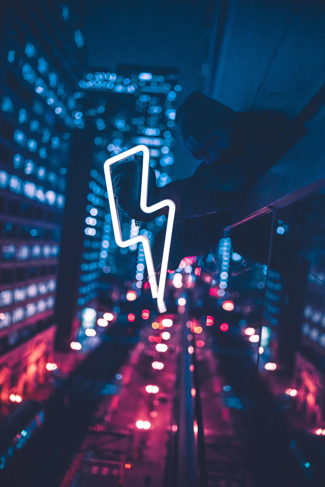

# Energy  

Even if electricty is not necessary to live, it's definitely a great help.
It powers many of our appliances and offer great services.

Unfortunately, most of it is produced in a centralized way. Take for instance nuclear centrals, coal mines, dams, wind turbines they are all owned by a minority (private companies) that have a full control on how they distribute it.  
You are totally dependant on their choices and they decide the price you'll pay.

This is definitely something not resilient.

To leverage this to your advantage you can have and create your own power.
The feeling of being totally off-grid is really priceless!

## Solar ☀️

The sun is creating a vast amount of energy every single day for free.  
It's just a matter of catching it efficiently.

For this you can invest into some **solar panels**. You'll also need **batteries** to stock the energy produced.
You need some basic knowledge about how electricty works to set up a good solar system but anyone can learn.  
An important aspect will be the location and orientation of your panels. You want to make sure they are exposed to as much sun as possible through the year.

## Water 💧

If you have the luck to have a river where you live you can setup a water turbine system. Depending on the water flow you can produce more or less water.

## Wind 🌬

When it's night time, your solar panels will produce 0 electricity.  
This is where wind comes into play as a valuable ally.
It usually produces less power than a solar panel but it's a really good complement.  
You want to set up your wind turbine on a very windy location.

## Petrol 🛢

You can use petrol or diesel to run a generator. This allows you to create electricty anytime very easily but.. it makes you dependant to petrol.

## Manual 🙌

Yeah! You can create energy yourself.
For instance you can have a dynamo lamp that light on based on the energy you give it.
You can also hack some DIY low tech projects. Like for instance a bike connected to a mixer so that the faster you pedal the more it blends.  
You can often come back to a low tech tool that doesn't require electricity or petrol. A saw instead of a chainsaw for instance.

> [!WARNING]
> Be aware that most of the technologies are not based on renewable energy even when it's called so.
> Indeed, we don't know how to recycle the batteries efficiently, nor the solar panels.
> So it's important to first rethink and reduce your energy consumption in order to be more reliant.
